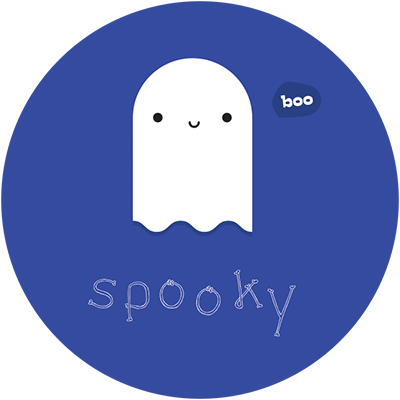

# Introduction

In this exploratory analysis, the work of three masters of horror novel/poem will be examined. The analysis tries to find out who wrote the scariest novels/poems. Three authors, namely Edgar Allan Poe, Mary Wollstonecraft Shelley and Howard Phillips Lovecraft, are popular horror authors in their time and in their countries. 



This analysis is mainly based on sentiment analysis and is divided into 2 major sections: single unit (word) analysis and full unit (paragraph) analysis. Packages used in this analysis include ggplot2, tibble, tidyr, stringr, tidytext, wordcloud, ggridges, dplyr, stopwords, sentimentr and tidyverse. 

```{r message=FALSE, warning=FALSE, include=FALSE}
setwd("~/Desktop/spring2018-project1-clairekong")
read.csv("~/Desktop/spring2018-project1-clairekong/data/spooky.csv")
Q <- read.csv("~/Desktop/spring2018-project1-clairekong/data/spooky.csv", stringsAsFactors = FALSE)
spooky<-read.csv("~/Desktop/spring2018-project1-clairekong/data/spooky.csv")

install.packages("ggplot2", repos = "http://cran.us.r-project.org")
install.packages("tibble", repos = "http://cran.us.r-project.org")
install.packages("tidyr", repos = "http://cran.us.r-project.org")
install.packages("stringr", repos = "http://cran.us.r-project.org")
install.packages("tidytext", repos = "http://cran.us.r-project.org")
install.packages("topicmodels", repos = "http://cran.us.r-project.org")
install.packages("wordcloud", repos = "http://cran.us.r-project.org")
install.packages("ggridges", repos = "http://cran.us.r-project.org")
install.packages("dplyr", repos = "http://cran.us.r-project.org")
install.packages("ggplot", repos = "http://cran.us.r-project.org")
install.packages("stopwords", repos = "http://cran.us.r-project.org")
install.packages("sentimentr",repos = "http://cran.us.r-project.org")
install.packages("tidyverse",repos = "http://cran.us.r-project.org")
library(ggplot2)
library(dplyr)
library(tibble)
library(tidyr)
library(stringr)
library(tidytext)
library(topicmodels)
library(wordcloud)
library(ggridges)
library(dplyr)
library(stopwords)
library(sentimentr)
library(tidyverse)
```

# Single Unit Analysis
## Seperating dataset

The dataset (spooky.csv) contains texts from works written by spooky authors: Edgar Allan Poe, Howard Phillips Lovecraft and Mary Wollstonecraft Shelley. The dataset has three columns: id, text and author. First, let's explore the data. 
```{r Data, echo=FALSE, message=FALSE, warning=FALSE}
summary(Q$author)
Q$author <- as.factor(Q$author)
```
We could see that, among 19579 rows, 7900 texts belong to EAP (Edgar Allan Poe), 5635 texts belong to HPL (Howard Phillips Lovecraft) and 6044 texts belong to MWS (Mary Wollstonecraft Shelley). 

To further analyse each word in given texts, I separated the dataset by authors' names and built up three datasets for each author. 
```{r Single Unit Analysis, echo=FALSE, message=FALSE, warning=FALSE}
Q_EAP<-Q[Q$author=='EAP',] 
Q_HPL<-Q[Q$author=='HPL',]
Q_MWS<-Q[Q$author=='MWS',]

summary(Q_EAP)
summary(Q_HPL)
summary(Q_MWS)
```
## Cleaning data

Then, I cleaned the data by removing all punctuation and transform all words into lower case using unnest_tokens and removing stopwords using anti_join. 

```{r Tidy, echo=FALSE, message=FALSE, warning=FALSE}
tidy_all <- unnest_tokens(Q, word, text)
all_wrd <- anti_join(tidy_all, stop_words, by = "word")
tidy_EAP <- unnest_tokens(Q_EAP, word, text)
tidy_HPL <- unnest_tokens(Q_HPL, word, text)
tidy_MWS <- unnest_tokens(Q_MWS, word, text)

tidy_EAP <- anti_join(tidy_EAP, stop_words, by = "word")
tidy_HPL <- anti_join(tidy_HPL, stop_words, by = "word")
tidy_MWS <- anti_join(tidy_MWS, stop_words, by = "word")
```


## Word frequency - Word Cloud
Now I will look into what are the most frequent words in each author's works by visualizing the data with word cloud function. Comparing the most frequent 100 words in each author's works, we may have a general idea of whose work is the scariest one. 
```{r Word Cloud, echo=FALSE, message=FALSE, warning=FALSE}
words_all <- count(group_by(all_wrd, word))$word
freqs_all <- count(group_by(all_wrd, word))$n

head(sort(freqs_all, decreasing = TRUE))
allcloud <- wordcloud(words_all, freqs_all, max.words = 100, size = 0.1, color=c("pink", "red4", "brown"))

words_EAP <- count(group_by(tidy_EAP, word))$word
freqs_EAP <- count(group_by(tidy_EAP, word))$n

head(sort(freqs_EAP, decreasing = TRUE))
wordcloud(words_EAP, freqs_EAP, max.words = 100, size = 1, scale=c(4,.1), color=c("pink", "red4", "brown"))

words_HPL <- count(group_by(tidy_HPL, word))$word
freqs_HPL <- count(group_by(tidy_HPL, word))$n

head(sort(freqs_HPL, decreasing = TRUE))
wordcloud(words_HPL, freqs_HPL, max.words = 100, size = 1, scale=c(4,.1), color = c("pink", "red4", "brown"))

words_MWS <- count(group_by(tidy_MWS, word))$word
freqs_MWS <- count(group_by(tidy_MWS, word))$n

head(sort(freqs_MWS, decreasing = TRUE))
wordcloud(words_MWS, freqs_MWS, max.words = 100, size = 1, scale=c(4,.1), color = c("pink", "red4", "brown"))
```

The above word clouds for three authors show the most frequent 100 words in their works. We could see that in EAP used words such as time and length most frequently in his work, HPL used words such as night, strange and heard most frequently in his work while MWS used words such as raymond, love and life most frequently in her work (which do not seem scary to me).

## Sentiment Analysis - word level

In this section, I apply sentiment analysis using NRC sentiment lexion. "The NRC Emotion Lexicon is a list of English words and their associations with eight basic emotions (anger, fear, anticipation, trust, surprise, sadness, joy, and disgust) and two sentiments (negative and positive). The annotations were manually done by crowdsourcing." 

```{r Sentiment-word, message=FALSE, warning=FALSE, include=FALSE}
get_sentiments('nrc')

sentiments_EAP <- inner_join(tidy_EAP, get_sentiments('nrc'), by = "word")
count(sentiments_EAP, sentiment)
count(sentiments_EAP, author, sentiment)
```

```{r echo=FALSE, message=FALSE, warning=FALSE}
ggplot(count(sentiments_EAP, sentiment)) + 
  geom_col(aes(sentiment, n, fill = sentiment))
```

```{r message=FALSE, warning=FALSE, include=FALSE}
sentiments_HPL <- inner_join(tidy_HPL, get_sentiments('nrc'), by = "word")
count(sentiments_HPL, sentiment)
count(sentiments_HPL, author, sentiment)
```


```{r echo=FALSE, message=FALSE, warning=FALSE}
ggplot(count(sentiments_HPL, sentiment)) + 
  geom_col(aes(sentiment, n, fill = sentiment))
```

```{r message=FALSE, warning=FALSE, include=FALSE}
sentiments_MWS <- inner_join(tidy_MWS, get_sentiments('nrc'), by = "word")
count(sentiments_MWS, sentiment)
count(sentiments_MWS, author, sentiment)
```


```{r echo=FALSE, message=FALSE, warning=FALSE}
ggplot(count(sentiments_MWS, sentiment)) + 
  geom_col(aes(sentiment, n, fill = sentiment))
```

Looking at the word-level sentiment analysis of three authors, we notice that HPL used fear and negative words most frequently while MWS and EAP used more positive words. 

## Words that make you fear

To further look into whose work is the scariest one, I filter the sentiment "fear" in the NRC lexicon and sorted the fear words that three authors used in their works to compare. 

```{r message=FALSE, warning=FALSE, include=FALSE}
nrc_fear <- filter(get_sentiments('nrc'), sentiment == "fear")

fear_EAP <- inner_join(tidy_EAP, nrc_fear, by = "word")
head(fear_EAP)
count(fear_EAP, word, sort = TRUE)

fear_HPL <- inner_join(tidy_HPL, nrc_fear, by = "word")
head(fear_HPL)
count(fear_HPL, word, sort = TRUE)

fear_MWS <- inner_join(tidy_MWS, nrc_fear, by = "word")
head(fear_MWS)
count(fear_MWS, word, sort = TRUE)

fear <- inner_join(tidy_all, nrc_fear, by = "word")
head(fear)
count(fear, word, sort = TRUE)

fear_words     <- count(group_by(fear, word, author))
fear_words_all <- count(group_by(fear, word))

fear_words <- left_join(fear_words, fear_words_all, by = "word")
fear_words <- arrange(fear_words, desc(n.y))
fear_words <- ungroup(head(fear_words, 81))
```

```{r echo=FALSE, message=FALSE, warning=FALSE}
ggplot(fear_words) +
  geom_col(aes(reorder(word, n.y, FUN = min), n.x, fill = author)) +
  xlab(NULL) +
  coord_flip() +
  facet_wrap(~ author) +
  theme(legend.position = "none")
```
Surprisingly, MWS used words such as death and fear more often than other two authors while she also used expressed more positive feelings in her works than others did. 

# Full Unit Analysis

Based on above analysis, it is still hard to say that who is the scariest author. Therefore, it may be necessary to look at different units of text and try to understand the sentiment of a sentence or paragraph as a whole. I cleaned the original dataset by removing all punctuation and transform all words into lower case using unnest_tokens and removing stopwords using anti_join and kept sentences in the original dataset instead of separating them into words. 

```{r message=FALSE, warning=FALSE, include=FALSE}
plot1 <- all_wrd %>%
inner_join(get_sentiments("nrc"), by = "word") %>%
ggplot(aes(author, fill = sentiment)) +
  geom_bar(position = "fill")

plot2 <- all_wrd %>%
  inner_join(get_sentiments("nrc"), by = "word") %>%
  group_by(author, id, sentiment) %>%
  count() %>%
  spread(sentiment, n, fill = 0) %>%
  group_by(author, id) %>%
  summarise(fearsum = sum(fear),
            sentimentsum = sum(anger+anticipation+disgust+joy+negative+positive+sadness+surprise+trust)) %>%
  arrange(id) %>%
  mutate(frac_fear = fearsum/(fearsum + sentimentsum)) %>%
  ggplot(aes(frac_fear, fill = author)) +
  geom_density(bw = .2, alpha = 0.3) +
  theme(legend.position = "right") +
  labs(x = "Fraction of fear words")

layout <- matrix(c(1,2),1,2,byrow=TRUE)
```

```{r echo=FALSE, message=FALSE, warning=FALSE}
plot1
plot2
```

I made two plots to compare authors' usage of fear words on the sentence level. As Plot 1 and Plot 2 show, HPL's works is the scariest for most of sentences in his works express fear or negative feelings while the works of EAP and MWS both tend to express more positive sentiment than HPL did. 

```{r echo=FALSE, message=FALSE, warning=FALSE}
require("tm")
tidy_sentence <- removeWords(Q$text, stopwords("en"))

sentiment = get_sentiments("afinn")

sentence <- Q[, 2]

tidy_all %>%
  group_by(author) %>%
  mutate(word_count = 1:n(),
         index = word_count %/% 50 + 1) %>%
  inner_join(get_sentiments("bing")) %>%
  count(author, index = index , sentiment) %>%
  ungroup() %>%
  spread(sentiment, n, fill = 0) %>%
  mutate(sentiment = positive - negative) %>%
  ggplot(aes(index, sentiment, fill = sentiment > 0)) +
    geom_bar(alpha = 0.5, stat = "identity", show.legend = FALSE) +
    facet_wrap(~ author, ncol = 2, scales = "free_x")
```

Last, I tried to "score" each author's works with Bing sentiment lexion which categorizes words in a binary fashion into positive and negative categories. As the result show, MWS tends to be the least scaries author and HPL tends to be the scaries author for his works score -5 on average. One sentence of EAP's works scores -10; however, his works are not as scary as HPL's on average. 
